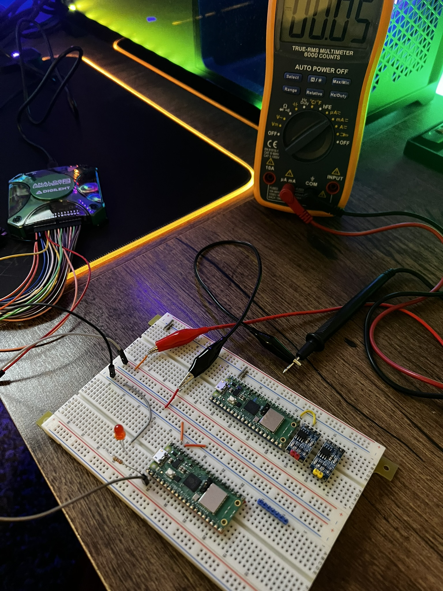

# Lab 10 for Semrah and Phelan

Main Branch Status:

Dev Branch Status: 

## Data
This table shows our measured data.

| Code Type                 | Supply Voltage    | Current        | Wattage |
|-----------------          |-------------------|----------------|---------|
| Blink (LED_ON)            | 3.3V              |      35mA      | 115.5mW |
| Blink (LED_OFF)           | 3.3V              |      28mA      | 92.4mW  |
| Blink RTOS (LED_ON)       | 3.3V              |      40mA      | 132mW   |
| Blink RTOS (LED_OFF)      | 3.3V              |      33mA      | 108.9mW |
| Busy                      | 3.3V              |      33mA      | 108.9mW |
| GPIO (No_Trigger)         | 3.3V              |      35mA      | 115.5mW |
| GPIO (1KHz)               | 3.3V              |      46mA      | 151.8mW |
| GPIO (100KHz)             | 3.3V              |      47mA      | 155.1mW |
| GPIO (500KHz)             | 3.3V              |      43mA      | 141.9mW |
| GPIO (1MHz)               | 3.3V              |      41mA      | 135.3mW |
| Sleep (Not_Sleeping)      | 3.3V              |      28mA      | 92.4mW  |
| Sleep (Sleeping)          | 3.3V              |      2mA       | 6.6mW   |
| Dormant (Not_Dormant)     | 3.3V              |      28mA      | 92.4mW  |
| Dormant (Dormant)         | 3.3V              |      1mA       | 3.3mW   |

## Setup
Measurements were taken at home. Used an Analog Discovery 2 for power supply and wavegen. Multimeter for measuring the current.

